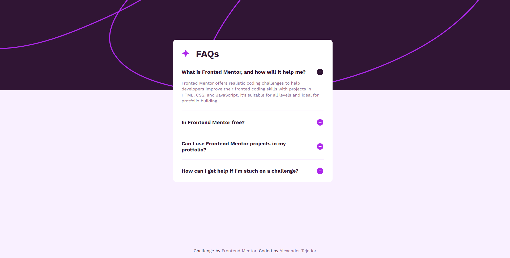

# Frontend Mentor - FAQ accordion solution

This is a solution to the [FAQ accordion challenge on Frontend Mentor](https://www.frontendmentor.io/challenges/faq-accordion-wyfFdeBwBz). Frontend Mentor challenges help you improve your coding skills by building realistic projects. 

## Table of contents

- [Overview](#overview)
  - [The challenge](#the-challenge)
  - [Screenshot](#screenshot)
  - [Links](#links)
- [My process](#my-process)
  - [Built with](#built-with)
  - [What I learned](#what-i-learned)
  - [Continued development](#continued-development)
  - [Useful resources](#useful-resources)
- [Author](#author)

## Overview

### The challenge

Users should be able to:

- Hide/Show the answer to a question when the question is clicked
- Navigate the questions and hide/show answers using keyboard navigation alone
- View the optimal layout for the interface depending on their device's screen size
- See hover and focus states for all interactive elements on the page

### Screenshot



### Links

- Solution URL: [GitHub Repo](https://github.com/AlexanderTejedor/FAQ-accordion)
- Live Site URL: [GitHub Pages](https://alexandertejedor.github.io/FAQ-accordion/)

## My process

### Built with

- Semantic HTML5 markup
- CSS custom properties
- JavaScript
- Flexbox
- CSS Grid
- Mobile-first workflow

### What I learned

In this challenge, I was able to implement my basic JavaScript knowledge, like accessing a DOM element and creating an interaction. I also applied an if conditional to change the image icon on the right side of the question. Overall, it was really cool.

```js
const faqs = document.querySelectorAll('.faq-item');

faqs.forEach(faq => {
    faq.addEventListener('click', () => {
        const img = faq.querySelector('.faq-question img');
        img.style.opacity = '0';
        setTimeout(() => {
            if (faq.classList.contains('active')) {
                img.src = './assets/images/icon-minus.svg';
            } else {
                img.src = './assets/images/icon-plus.svg';
            }
            img.style.opacity = '1';
        }, 60);
        faq.classList.toggle('active');
    })
})
```

### Continued development

Now that I have finished this challenge, I want to continue working on basic projects until I have enough confidence to tackle more advanced ones. I am reinforcing my knowledge with JavaScript, so soon I will venture into doing the best challenges.

### Useful resources

- [Google Fonts](https://fonts.google.com/) - This helped me to use external fonts instead of local ones, so that everyone can identify the type of font I used for this challenge.
- [nekpCalc](https://nekocalc.com/es/px-a-rem-conversor) - I used this page to support me with relative measurements like rem. I used it as a reference to use the rem measurement in my project and improve the challenge.

## Author

- Website - [Alexander Tejedor](https://github.com/AlexanderTejedor)
- Frontend Mentor - [@AlexanderTejedor](https://www.frontendmentor.io/profile/AlexanderTejedor)
- Twitter - [@Alexand59894016](https://x.com/Alexand59894016)
